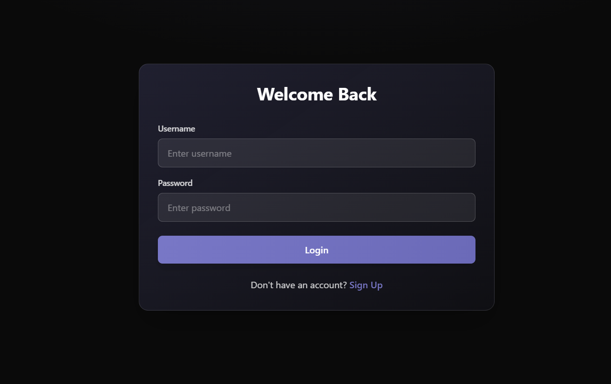
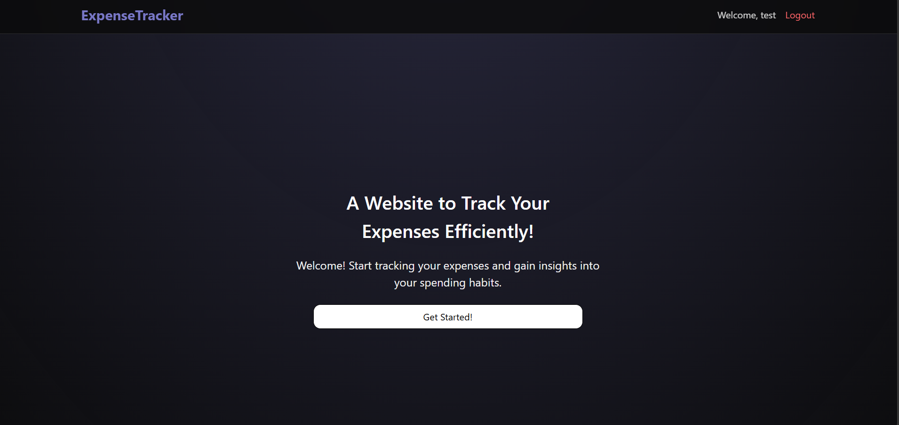
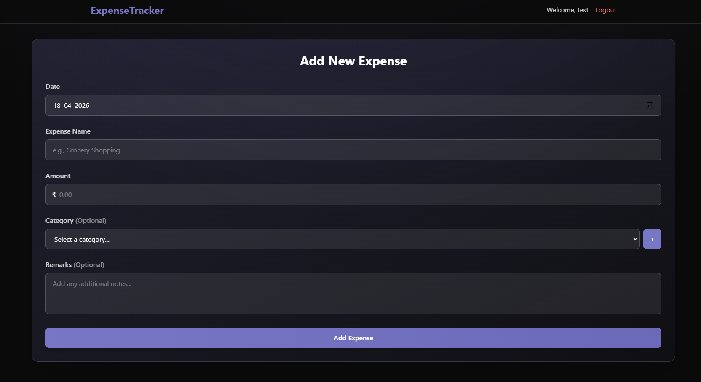
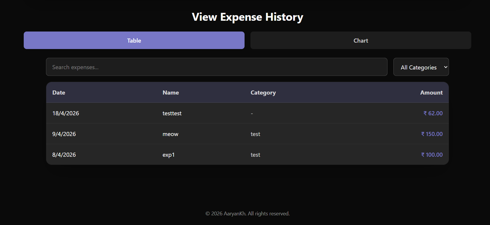
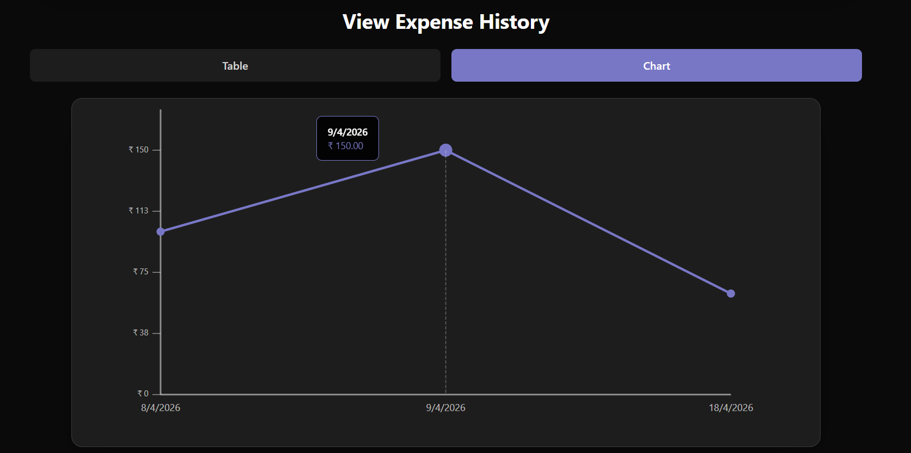
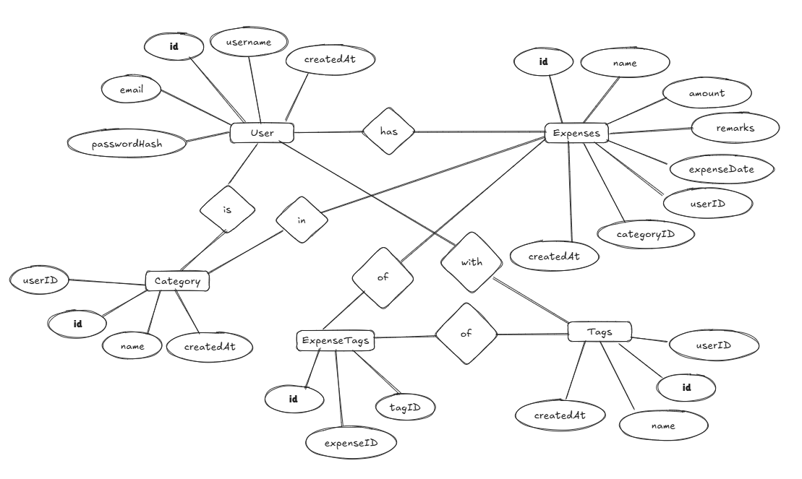

# CS255 Project - Expense Tracker
## 1. Project Information
- **Roll No.:** 24CSE1027
- **Name:** Aaryan Khedekar
- **Project Title:** Expense Tracker - A Full-Stack Personal Finance Management Application

---

## 2. Project Description
The **Expense Tracker** is a comprehensive web-based application designed to help users manage and monitor their personal finances effectively. Users can create accounts, log their daily expenses, categorize spending, and visualize their financial data through interactive charts. The application provides real-time tracking, detailed expense management, and analytical insights to support better financial decision-making.

### Key Objectives:
- Enable users to securely register and authenticate their accounts
- Allow users to log, organize, and manage their daily expenses
- Provide categorization and tagging capabilities for better expense organization
- Visualize spending patterns through interactive line charts
- Generate analytics reports for financial insights
- Ensure data security and integrity through proper authentication and authorization

---

## 3. Technologies Used
### Frontend Technologies:
- **React 19.2.4** - Modern JavaScript library for building interactive user interfaces
- **TypeScript** - Typed superset of JavaScript for better code quality and type safety
- **Tailwind CSS 4.2.2** - Utility-first CSS framework for responsive design
- **Framer Motion 12.38.0** - Animation library for smooth UI transitions
- **Vite 8.0.1** - Fast build tool and development server
- **React DOM 19.2.4** - React package for DOM rendering

### Backend Technologies:
- **Node.js & Express 5.2.1** - Server framework for building RESTful APIs
- **TypeScript** - Type-safe backend development
- **MySQL 2** - Relational database management system
- **JWT (jsonwebtoken 9.0.3)** - Token-based authentication mechanism
- **Bcrypt 6.0.0** - Password hashing for secure authentication
- **CORS** - Cross-Origin Resource Sharing for frontend-backend communication
- **dotenv** - Environment variable management

### Development Tools:
- **ESLint** - Code quality and linting
- **npm** - Package manager for dependency management

---

## 4. Implemented Features

### A. Authentication & User Management
- **User Registration** - Create new accounts with username, email, and password
- **Secure Login** - JWT-based authentication with token management
- **Session Management** - Persistent login with localStorage token storage
- **Logout** - Secure session termination with token cleanup
- **Password Security** - Bcrypt hashing with 10-round salt for secure password storage

### B. Expense Management
- **Add Expenses** - Create new expense entries with:
   - Expense name/description
   - Amount in currency
   - Date of expense
   - Remarks/notes
   - Category assignment
   - Tag association

- **View Expenses** - Display all expenses in a structured table format with:
   - Expense details
   - Category information
   - Tags associated with expenses
   - Expense date and amount

- **Search & Filter** - Real-time search functionality to find expenses by name
- **Delete Expenses** - Remove expenses with confirmation modal
- **Category Management** - Create and manage custom expense categories
- **Tagging System** - Add multiple tags to expenses for better organization

### C. Data Visualization & Analytics
- **Interactive Line Chart** - Visualize spending trends over time
- **Analytics Dashboard** - View comprehensive expense statistics
- **CSV Export** - Download expense data in CSV format for external analysis

### D. User Interface
- **Responsive Design** - Mobile-friendly interface using Tailwind CSS
- **Modal Components** - User-friendly modals for:
   - Authentication (login/signup)
   - Viewing expense details
   - Adding new expenses
   - Analytics dashboard
   - Alert notifications

- **Navigation** - Smooth navigation with tab switching between table and chart views
- **Alert System** - Real-time notifications for success, error, warning, and info messages
- **Animated Transitions** - Smooth animations using Framer Motion for better UX

### E. Data Management
- **Prepared SQL Statements** - SQL injection prevention through parameterized queries
- **Foreign Key Relationships** - Maintain data integrity across tables
- **Cascade Delete** - Automatic cleanup of dependent records
- **Unique Constraints** - Prevent duplicate entries where necessary

---

## 5. Screenshots
1. Login


2. Home


3. Add Expense


4. Expenses Table


5. Analytics Chart


---

## 6. Database Schema
### Database Design Overview
The database uses MySQL relational model with 5 main tables connected through foreign key relationships to maintain data integrity and enable efficient querying.

### Database Tables
#### Table 1: `User`
Stores user account information with authentication credentials.

```sql
CREATE TABLE IF NOT EXISTS User(
    id              INT PRIMARY KEY AUTO_INCREMENT,
    username        VARCHAR(255) NOT NULL UNIQUE,
    email           VARCHAR(255) NOT NULL UNIQUE,
    passwordHash    TEXT NOT NULL,
    createdAt       TIMESTAMP DEFAULT CURRENT_TIMESTAMP
);
```

| Column | Type | Constraints | Description |
|--------|------|-------------|-------------|
| id | INT | PRIMARY KEY, AUTO_INCREMENT | Unique user identifier |
| username | VARCHAR(255) | NOT NULL, UNIQUE | Username for login (must be unique) |
| email | VARCHAR(255) | NOT NULL, UNIQUE | User email address (must be unique) |
| passwordHash | TEXT | NOT NULL | Bcrypt hashed password |
| createdAt | TIMESTAMP | DEFAULT CURRENT_TIMESTAMP | Account creation timestamp |

**Sample Data:**
```
id | username      | email               | passwordHash | createdAt
1  | john_doe      | john@example.com    | $2b$10$...   | 2024-01-15 10:30:00
2  | jane_smith    | jane@example.com    | $2b$10$...   | 2024-01-16 14:45:00
```

---

#### Table 2: `Category`
Stores user-defined expense categories.

```sql
CREATE TABLE IF NOT EXISTS Category(
    id              INT PRIMARY KEY AUTO_INCREMENT,
    userID          INT NOT NULL,
    name            VARCHAR(100) NOT NULL,
    createdAt       TIMESTAMP DEFAULT CURRENT_TIMESTAMP,
    FOREIGN KEY (userID) REFERENCES User(id) ON DELETE CASCADE,
    UNIQUE KEY unique_user_category (userID, name)
);
```

| Column | Type | Constraints | Description |
|--------|------|-------------|-------------|
| id | INT | PRIMARY KEY, AUTO_INCREMENT | Unique category identifier |
| userID | INT | NOT NULL, FOREIGN KEY | Reference to User table |
| name | VARCHAR(100) | NOT NULL | Category name (e.g., "Food", "Transport") |
| createdAt | TIMESTAMP | DEFAULT CURRENT_TIMESTAMP | Category creation timestamp |
| unique_user_category | - | UNIQUE KEY | Ensures user cannot create duplicate categories |

**Sample Data:**
```
id | userID | name       | createdAt
1  | 1      | Food       | 2024-01-15 10:35:00
2  | 1      | Transport  | 2024-01-15 10:40:00
3  | 1      | Utilities  | 2024-01-15 11:00:00
4  | 2      | Food       | 2024-01-16 15:00:00
```

---

#### Table 3: `Expenses`
Stores individual expense records with details.

```sql
CREATE TABLE IF NOT EXISTS Expenses(
    id              INT PRIMARY KEY AUTO_INCREMENT,
    name            TEXT NOT NULL,
    amount          FLOAT NOT NULL,
    remarks         TEXT,
    expenseDate     DATE NOT NULL,
    userID          INT NOT NULL,
    categoryId      INT,
    createdAt       TIMESTAMP DEFAULT CURRENT_TIMESTAMP,
    FOREIGN KEY (userID) REFERENCES User(id) ON DELETE CASCADE,
    FOREIGN KEY (categoryId) REFERENCES Category(id) ON DELETE SET NULL
);
```

| Column | Type | Constraints | Description |
|--------|------|-------------|-------------|
| id | INT | PRIMARY KEY, AUTO_INCREMENT | Unique expense identifier |
| name | TEXT | NOT NULL | Expense description/name |
| amount | FLOAT | NOT NULL | Expense amount in currency |
| remarks | TEXT | - | Additional notes about the expense |
| expenseDate | DATE | NOT NULL | Date when expense occurred |
| userID | INT | NOT NULL, FOREIGN KEY | Reference to User table |
| categoryId | INT | FOREIGN KEY | Reference to Category table |
| createdAt | TIMESTAMP | DEFAULT CURRENT_TIMESTAMP | Record creation timestamp |

**Sample Data:**
```
id | name              | amount | remarks          | expenseDate | userID | categoryId | createdAt
1  | Grocery Shopping  | 45.50  | Weekly groceries | 2024-01-15  | 1      | 1          | 2024-01-15 10:45:00
2  | Taxi Ride         | 12.00  | To office        | 2024-01-15  | 1      | 2          | 2024-01-15 11:00:00
3  | Electric Bill     | 85.00  | Monthly payment  | 2024-01-15  | 1      | 3          | 2024-01-15 12:00:00
4  | Restaurant        | 35.75  | Dinner with team | 2024-01-16  | 2      | 4          | 2024-01-16 15:30:00
```

---

#### Table 4: `Tags`
Stores user-defined tags for categorizing expenses.

```sql
CREATE TABLE IF NOT EXISTS Tags(
    id              INT PRIMARY KEY AUTO_INCREMENT,
    userID          INT NOT NULL,
    name            VARCHAR(100) NOT NULL,
    createdAt       TIMESTAMP DEFAULT CURRENT_TIMESTAMP,
    FOREIGN KEY (userID) REFERENCES User(id) ON DELETE CASCADE
);
```

| Column | Type | Constraints | Description |
|--------|------|-------------|-------------|
| id | INT | PRIMARY KEY, AUTO_INCREMENT | Unique tag identifier |
| userID | INT | NOT NULL, FOREIGN KEY | Reference to User table |
| name | VARCHAR(100) | NOT NULL | Tag name (e.g., "Urgent", "Monthly") |
| createdAt | TIMESTAMP | DEFAULT CURRENT_TIMESTAMP | Tag creation timestamp |

**Sample Data:**
```
id | userID | name      | createdAt
1  | 1      | Urgent    | 2024-01-15 10:50:00
2  | 1      | Monthly   | 2024-01-15 10:55:00
3  | 1      | Recurring | 2024-01-15 11:05:00
4  | 2      | Urgent    | 2024-01-16 15:35:00
```

---

#### Table 5: `ExpenseTags`
Junction table for many-to-many relationship between Expenses and Tags.

```sql
CREATE TABLE IF NOT EXISTS ExpenseTags(
    id              INT PRIMARY KEY AUTO_INCREMENT,
    expenseId       INT NOT NULL,
    tagId           INT NOT NULL,
    FOREIGN KEY (expenseId) REFERENCES Expenses(id) ON DELETE CASCADE,
    FOREIGN KEY (tagId) REFERENCES Tags(id) ON DELETE CASCADE,
    UNIQUE KEY unique_expense_tag (expenseId, tagId)
);
```

| Column | Type | Constraints | Description |
|--------|------|-------------|-------------|
| id | INT | PRIMARY KEY, AUTO_INCREMENT | Unique junction record identifier |
| expenseId | INT | NOT NULL, FOREIGN KEY | Reference to Expenses table |
| tagId | INT | NOT NULL, FOREIGN KEY | Reference to Tags table |
| unique_expense_tag | - | UNIQUE KEY | Prevents duplicate tag assignments |

**Sample Data:**
```
id | expenseId | tagId
1  | 1         | 1
2  | 1         | 2
3  | 2         | 1
4  | 3         | 2
5  | 3         | 3
```

---

### Database Relationships Diagram


## 7. Conclusion
The **Expense Tracker** application demonstrates a complete full-stack web development solution integrating modern frontend and backend technologies. 

### Key Achievements:
1. **Secure Architecture** - Implemented JWT-based authentication with bcrypt password hashing, ensuring user data security and privacy.

2. **Scalable Design** - Built with a modular component-based architecture that allows easy addition of new features and maintenance.

3. **User-Centric Interface** - Created an intuitive, responsive interface with smooth animations and real-time updates for seamless user experience.

4. **Data Integrity** - Designed a well-structured relational database with proper foreign key relationships and constraints to maintain data consistency.

5. **Complete Feature Set** - Implemented all core functionality including authentication, expense management, categorization, tagging, visualization, and analytics.

6. **Modern Technology Stack** - Utilized current industry-standard technologies (React, TypeScript, Tailwind CSS, Node.js, Express, MySQL) ensuring maintainability and future scalability.

### Learning Outcomes:
This project demonstrates proficiency in:
- Full-stack web development
- RESTful API design and implementation
- Database design and SQL query optimization
- Authentication and authorization mechanisms
- Frontend component architecture and state management
- Responsive web design principles
- Error handling and validation techniques
- Security best practices in web applications

### Future Enhancements:
Potential features for future versions:
- Advanced reporting and budget tracking
- Recurring expense automation
- Multi-currency support
- Data import/export functionality
- Mobile application version
- Real-time notifications and reminders
- Shared expenses and group management
- AI-powered spending recommendations

The Expense Tracker application serves as a solid foundation for personal finance management and can be extended with additional features based on user requirements and business needs.

---

**Project Repository:** https://github.com/AaryanKhClasses/CS255-Project
**Project Owner:** [AaryanKh](https://github.com/AaryanKhClasses)
